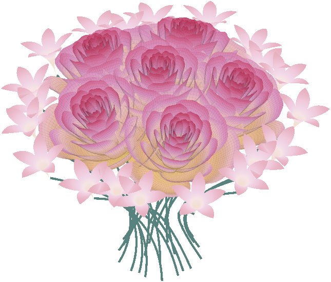
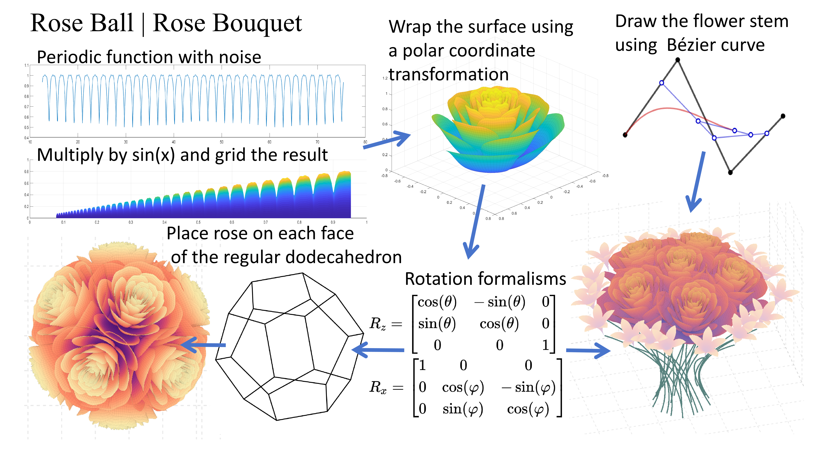

# rose bounquet

```matlab
roseBouquet()
```

```matlab
CList = [.92 .75 .38; .93 .77 .49; .93 .75 .60; .89 .70 .53;
         .88 .69 .62; .92 .74 .75; .86 .60 .77; .85 .47 .64; 
         .76 .21 .36];
roseBouquet(gca, CList)
```

```matlab
CList = [.13 .10 .16; .20 .09 .20; .28 .08 .23; .42 .08 .30;
         .51 .07 .34; .66 .12 .35; .79 .22 .40; .88 .35 .47;
         .90 .45 .54; .89 .78 .79];
roseBouquet(CList)
```

```matlab
CList = [.33 .33 .69; .53 .40 .68; .68 .42 .63; .78 .42 .57
         .91 .49 .47; .96 .73 .44];
roseBouquet(CList)
```


## Schematic Diagram

